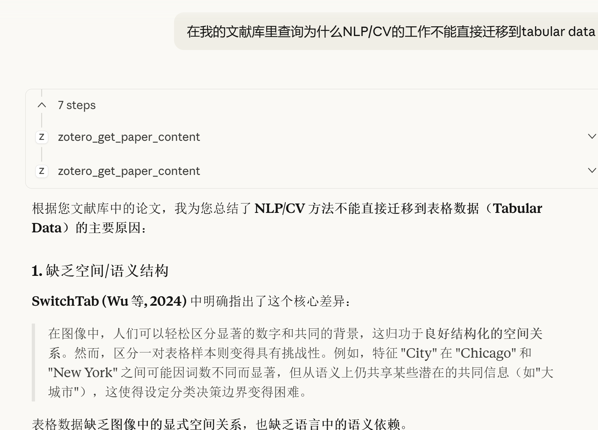

# Zotero RAG - 本地文献知识库

基于 Zotero 本地文献库的 RAG 问答系统，支持 Claude Desktop MCP 集成。

## ✨ 特性

- 🔌 **MCP Server** - 直接在 Claude Desktop 中搜索文献
- 📚 直接读取 Zotero 本地存储
- 🏷️ 自动从文件名解析作者、年份、标题
- 📄 按页分块，精确到页码引用
- 💬 带引用来源的 RAG 问答
- 🖥️ 命令行 + Web 界面

## 🚀 快速开始

### 1. 安装 Ollama 和模型

```bash
# 安装 Ollama
# Windows: 从 https://ollama.com 下载安装

# 拉取模型
ollama pull qwen2.5:7b-instruct-q4_K_M #如果决定不使用本地大模型，可以不pull这个
ollama pull nomic-embed-text
```

### 2. 安装依赖

```bash
cd LocalKnowledge
pip install -r requirements.txt
```

### 3. 配置

编辑 `config.yaml`，设置 Zotero 路径：

```yaml
zotero:
  data_dir: "C:/Users/你的用户名/Zotero"

ollama:
  base_url: "http://localhost:11434"
  llm_model: "qwen2.5:7b-instruct-q4_K_M"
  embed_model: "nomic-embed-text"

rag:
  similarity_threshold: 0.3  # 根据效果调整
```

### 4. 构建索引

```bash
python indexer.py
```

### 5. 开始使用

**方式一：Claude Desktop MCP（推荐）**

见下方 [MCP 配置](#-mcp-配置claude-desktop)

**方式二：命令行**

```bash
python query.py
```

**方式三：Web 界面**

```bash
python web_ui.py
# 访问 http://localhost:7860
```

## 🔌 MCP 配置（Claude Desktop）

让 Claude Desktop 直接访问你的文献库！

### 配置步骤

1. 找到 Claude Desktop 配置文件：

Setting->Developer->Edit Config

   - Windows: `%APPDATA%\Claude\claude_desktop_config.json`
   - macOS: `~/Library/Application Support/Claude/claude_desktop_config.json`

2. 添加 MCP Server 配置：

```json
{
  "mcpServers": {
    "zotero": {
      "command": "python",
      "args": ["C:\\Users\\你的用户名\\LocalKnowledge\\mcp_server.py"]
    }
  }
}
```
此处的"command": "python"，如果你采用了虚拟环境，请换成你的虚拟环境对应的python指令，如C:\\Users\\xxx\LocalKnowledge\\.venv\\Scripts\\python.exe
3. 重启 Claude Desktop

### 可用工具

| 工具 | 功能 |
|------|------|
| `zotero_search` | 语义搜索文献内容 |
| `zotero_list_papers` | 列出论文，支持年份筛选 |
| `zotero_get_paper_content` | 获取特定论文内容 |
| `zotero_stats` | 查看文献库统计 |

### 使用示例

在 Claude Desktop 中直接问：

- "搜索我的文献库里关于 knowledge distillation 的内容"
- "我的文献库有哪些 2024 年的论文？"
- "总结一下 Dropout Connects Transformers 这篇论文"
- "我的 Zotero 文献库统计信息"

## 📁 项目结构

```
LocalKnowledge/
├── config.yaml        # 配置文件
├── indexer.py         # 索引构建器
├── query.py           # 命令行查询
├── web_ui.py          # Gradio Web 界面
├── mcp_server.py      # MCP Server（Claude Desktop 集成）
├── requirements.txt   # 依赖
└── data/
    ├── chroma_db/     # 向量数据库
    └── cache/         # 索引状态缓存
```

## ⚙️ 配置说明

```yaml
# config.yaml

zotero:
  data_dir: "~/Zotero"      # Zotero 数据目录
  # storage_dir: "..."      # 或直接指定 storage 目录

paths:
  vector_db: "./data/chroma_db"
  cache_dir: "./data/cache"

ollama:
  base_url: "http://localhost:11434"
  llm_model: "qwen2.5:7b-instruct-q4_K_M"  # 8GB 显存推荐
  embed_model: "nomic-embed-text"

rag:
  chunk_size: 1024
  chunk_overlap: 200
  top_k: 5
  similarity_threshold: 0.3  # 太高会导致 Empty Response
```

## 💻 硬件建议

| 显存 | 推荐模型 |
|------|---------|
| 16GB | `qwen2.5:14b-instruct-q4_K_M` |
| 8GB | `qwen2.5:7b-instruct-q4_K_M` |
| 4GB | `qwen2.5:3b-instruct` |

## 📖 命令参考

```bash
# 构建索引
python indexer.py

# 强制重建索引
python indexer.py --force

# 查看统计
python indexer.py --stats

# 列出已索引文献
python indexer.py --list

# 命令行查询
python query.py -q "你的问题"

# 交互模式
python query.py

# Web 界面
python web_ui.py --port 7860
```
## 示例


## ❓ 常见问题

**Q: 回答显示 Empty Response？**

A: 降低 `config.yaml` 中的 `similarity_threshold`，从 0.7 改为 0.3 或更低。

**Q: MCP Server 不工作？**

A: 
1. 确认配置文件路径正确
2. 尝试使用完整 Python 路径：`C:\\Users\\...\\LocalKnowledge\\.venv\\Scripts\\python.exe`
3. 手动运行 `python mcp_server.py` 检查报错

**Q: 索引需要多久？**

A: 取决于 PDF 大小和硬件性能。

**Q: 如何更新索引？**

A: 直接运行 `python indexer.py`，会自动检测新增/修改的文件。

## 📄 License

MIT